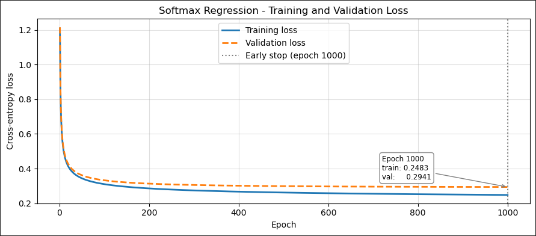
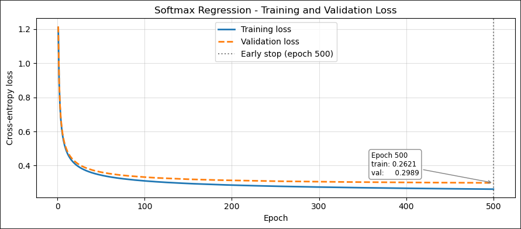
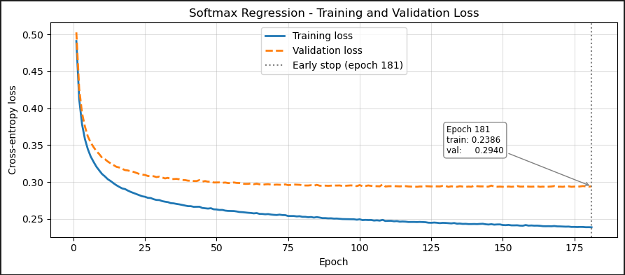

# Hyperparameter Comparison — Softmax Regression

Save loss curve images to `../images/` and link them below.  
Naming convention: `loss_run1.png`, `loss_run2.png`, etc.

---

## Run 1

| Hyperparameter | Value |
|---|---|
| `lr` | 0.01 |
| `max_epochs` | 1000 |
| `batch_size` | 256 |
| `patience` | 50 |

**Loss curve**

**Results**

| Metric | Value |
|---|---|
| Epochs run | |
| Train loss (final) | |
| Val loss (final) | |
| Train accuracy | |
| Val accuracy | |

**Notes**

---

## Run 2

| Hyperparameter | Value |
|---|---|
| `lr` | 0.1 |
| `max_epochs` | 500 |
| `batch_size` | 128 |
| `patience` | |

**Loss curve**

**Results**

| Metric | Value |
|---|---|
| Epochs run | |
| Train loss (final) | |
| Val loss (final) | |
| Train accuracy | |
| Val accuracy | |

**Notes**

---

## Run 3

| Hyperparameter | Value |
|---|---|
| `lr` | 0.1 |
| `max_epochs` | 500 |
| `batch_size` | 256 |
| `patience` | 50 |

**Loss curve**

**Results**

| Metric | Value |
|---|---|
| Epochs run | |
| Train loss (final) | |
| Val loss (final) | |
| Train accuracy | |
| Val accuracy | |

**Notes**

---

## Run 4

| Hyperparameter | Value |
|---|---|
| `lr` | |
| `max_epochs` | |
| `batch_size` | |
| `patience` | |

**Loss curve**

**Results**

| Metric | Value |
|---|---|
| Epochs run | |
| Train loss (final) | |
| Val loss (final) | |
| Train accuracy | |
| Val accuracy | |

**Notes**

---

## Run 5

| Hyperparameter | Value |
|---|---|
| `lr` | |
| `max_epochs` | |
| `batch_size` | |
| `patience` | |

**Loss curve**

**Results**

| Metric | Value |
|---|---|
| Epochs run | |
| Train loss (final) | |
| Val loss (final) | |
| Train accuracy | |
| Val accuracy | |

**Notes**

---

## Summary

| Run | lr | batch_size | patience | Epochs run | Train acc | Val acc |
|---|---|---|---|---|---|---|
| 1 | | | | | | |
| 2 | | | | | | |
| 3 | | | | | | |
| 4 | | | | | | |
| 5 | | | | | | |

**Best run:**

**Key takeaways:**
